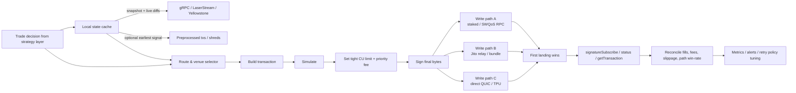
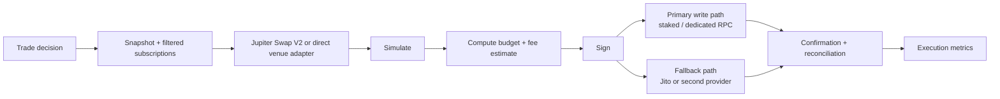

# Solana Trading Bot Execution Layer

## Executive summary

The current Solana execution frontier is no longer “build a transaction and call `sendTransaction` on one RPC.” The best landing stacks now combine three ideas: a leader-adjacent write path, a state feed faster than vanilla WebSockets, and client-controlled retries. Official Solana docs make clear that public RPC endpoints are shared infrastructure and not intended for production, while validator ingress now happens over QUIC with stake-based connection and packet-rate limits. In practice, serious operators therefore fan out the same signed bytes across dedicated/private RPC, stake-weighted routes, and private relay paths instead of trusting one public endpoint or one provider queue. citeturn22view0turn5view0turn5view2turn9view1turn6view1

The most important consensus shift in the last 18 months is that **client-side execution policy has replaced RPC-node retry policy**. Triton’s current transaction-sending guidance explicitly says to handle retries in your own code, send with `maxRetries: 0`, simulate separately, and then send with `skipPreflight: true`; Jito’s low-latency send path also always sets `skip_preflight=true`; and Helius’ Sender now dual-routes to validators and Jito. That combination—separate simulation, tight compute budget, competitive priority fee, and multi-path broadcast—is the present baseline for low-latency Solana execution. citeturn9view3turn6view2turn9view0

The current fastest read path is also no longer plain RPC polling. Backend operators have largely moved from standard WebSockets toward Geyser-based gRPC and, at the frontier, shred or preprocessed-transaction feeds. Triton’s Dragon’s Mouth recommends gRPC for future backend development and says it can provide up to a 400 ms advantage versus regular RPC because it streams updates within the slot; Helius’ LaserStream adds multi-node reliability plus 24-hour replay; Helius’ preprocessed transactions arrive around 8 ms earlier than `processed`; and raw shred products such as Helius Shred Delivery and Jito ShredStream target the absolute earliest signal, with Jito claiming savings of hundreds of milliseconds. citeturn27search3turn13view2turn19view3turn13view3turn3search3

Cost optimization on Solana execution is now dominated by four levers: requested compute units, priority-fee estimation quality, unnecessary account creation/rent, and failed-transaction/slippage waste. The network fee schedule is simple—5,000 lamports per signature plus optional prioritization fee equal to `ceil(compute_unit_price * compute_unit_limit / 1,000,000)`—but the critical detail is that the priority fee is charged on **requested** CUs, not actual usage. Over-requesting compute is therefore a direct cost leak. The docs now explicitly recommend simulating first and adding only about a 10% safety margin. citeturn5view3turn36view0

For swaps and venue selection, the current default “managed” route is Jupiter Swap V2, which supersedes Ultra/older Metis-only paths. Jupiter now exposes two distinct paths: a meta-aggregator route, where multiple routing engines compete and Jupiter manages landing, and a router path, where you get raw instructions and keep full transaction control. That split mirrors the market: moderate-frequency or cost-sensitive bots increasingly outsource routing and landing; high-frequency bots keep routing local and integrate venue SDKs directly for Raydium, Orca, Meteora, Phoenix, or OpenBook when they need absolute control over accounts, compute, fees, and submission timing. citeturn14search0turn13view4turn16search1turn16search4turn16search6turn17search0turn17search2

The practical build advice is therefore bifurcated. A **moderate-frequency, cost-sensitive** setup should use dedicated/private RPC, gRPC or enhanced stream subscriptions, separate simulation, tight CU limits, percentile-style priority-fee estimation, and one managed fallback like Jito or a staked route. A **low-latency, high-frequency** setup should add a leader-adjacent write fanout layer, direct QUIC/TPU forwarding or a QUIC forwarder, shred/preprocessed transaction ingestion, multi-region relays, and a metrics layer that attributes every landed trade to its winning path, slot timing, fees paid, and slippage realized. citeturn29view2turn9view4turn19view3turn6view1turn30search1turn24search17

## How transactions get onto Solana today

There are now five materially distinct submission paths.

The baseline path remains **standard JSON-RPC `sendTransaction`**. The Solana RPC method simply relays a fully signed transaction as-is; success means only that the RPC accepted it, not that the cluster processed or confirmed it. Preflight can verify signatures and simulate against the requested commitment, but that adds latency; `maxRetries` and `minContextSlot` are configurable. This path is universal and lowest-friction, but under contention it is the least differentiated. Public shared endpoints are explicitly not for production and may rate-limit or block traffic. citeturn5view2turn22view0

The next tier is **dedicated/private or staked RPC**, which is now the normal production write lane. Helius documents “staked connections” as the recommended production path, routing directly to current and upcoming block leaders and bypassing public queues; Triton’s Cascade is built around Solana’s stake-weighted QoS and private validator connection pools; and the underlying validator TPU documentation confirms that higher-stake senders get more QUIC streams and packet-per-second bandwidth. This is the mainline approach for reliable landing without fully running your own forwarder stack. citeturn9view1turn9view2turn9view4turn5view0turn3search1

The frontier public-mechanics path is **direct QUIC/TPU forwarding**. Agave’s TPU docs describe validator ingress over QUIC streams, stake-aware stream limits, per-connection PPS limits, sigverify deduplication, and leader forwarding. Solana CLI still exposes `--use-tpu-client`, and open-source senders like Triton’s Yellowstone Jet implement the QUIC protocol directly, add SWQoS support, expose Prometheus metrics, and can operate as a transaction-sending proxy. This path minimizes hops, but it raises operational complexity steeply: leader targeting, QUIC tuning, backoff on throttle errors, key handling, and multi-path failover all become your job. citeturn5view0turn4search2turn29view2

The specialized private-orderflow path is **relay / block-engine / bundle submission**. Jito’s block engine accepts single transactions and bundles over gRPC or JSON-RPC; bundles are up to five transactions, execute atomically, and compete in 50 ms parallel auctions priced by tips and CU efficiency. Jito’s transaction endpoint sends directly to validators, defaults to MEV protection, always sets `skip_preflight=true`, and recommends both a normal priority fee and a Jito tip in competitive conditions; its bundle-only mode provides revert protection. Current Jito docs expose multiple regional block-engine endpoints plus regional NTP servers, which makes region placement part of execution design. citeturn6view1turn6view2turn7view3

A parallel commercial category is **provider relay networks that combine staked routing, private propagation, and region fanout**. bloXroute’s current Solana Trader API recommends priority fee plus a tip, advises sending to the global endpoint and the nearest region in parallel, supports HTTP/WS/gRPC submit, and documents a “fastest mode” that uses staked RPCs with a 0.001 SOL minimum tip, alongside a slower revert-protected mode that only sends to Jito and Paladin leaders. This is operationally similar to Jito plus staked routing, but offered as a managed transport layer rather than a pure block engine. citeturn30search1

A newer category is **managed-landing APIs**, where routing and broadcast are wrapped into the venue or aggregator. Jupiter Swap V2’s meta-aggregator path returns an assembled transaction and lets Jupiter handle landing, while the `/execute` API takes a signed transaction and performs managed landing. Current Jupiter docs position this as the simplest route for most swap integrations, while the “router” path exists for teams that want raw instructions and full control. citeturn14search0turn14search12

The most important operator pattern is not choosing one of these paths. It is **fanout**. Validators deduplicate packets in sigverify, so sending the same signed transaction over multiple non-conflicting paths is mechanically safe and raises time-to-first-land probability; Helius Sender explicitly markets dual routing to validators plus Jito, and bloXroute recommends parallel send to global and regional endpoints. The present execution frontier is therefore multi-path broadcast with per-path attribution, not single-path submission. citeturn5view0turn9view0turn30search1

### Transaction submission paths

| Path | Mechanics | Latency / landing profile | Reliability profile | Direct costs | Current provider / OSS examples |
|---|---|---|---|---|---|
| Standard JSON-RPC | `sendTransaction` over HTTP; optional preflight; RPC relays signed bytes as-is. citeturn5view2 | Highest tail latency under congestion. | Depends heavily on provider queue behavior; public shared RPC is not for production. citeturn22view0turn5view2 | Base fee + any priority fee. citeturn5view3 | Any Solana RPC endpoint; self-hosted Agave RPC. citeturn22view0turn4search1 |
| Dedicated / staked RPC | Provider routes directly toward leaders via stake-backed bandwidth. citeturn9view1turn9view2 | Lower and more predictable than public RPC. | Strong for production if provider has direct leader routing. citeturn9view1turn9view2 | Usually monthly provider cost plus normal fees. [Inference] supported by provider docs. citeturn9view1turn9view2 | Helius staked connections; Triton Cascade. citeturn9view2turn9view4 |
| Direct QUIC / TPU | Client speaks QUIC to validator TPU / forwarder; stake affects stream and PPS quotas. citeturn5view0 | Lowest hop count if leader-targeted correctly. | Best when tuned well; easiest to degrade if QUIC/backoff logic is poor. citeturn5view0turn29view2 | No external relay toll by default; high engineering cost. [Inference] citeturn29view2 | Agave TPU client; Yellowstone Jet; custom QUIC senders. citeturn4search2turn29view2 |
| SWQoS bandwidth marketplace / private validator bandwidth | Uses private stake-weighted bandwidth pools rather than public ports. citeturn9view4turn3search1 | Strong congestion performance. | Better than public ports during contention. citeturn9view4turn3search1 | Provider-specific; Triton says SWQoS bandwidth is currently offered free on request in Cascade. citeturn9view4turn8search9 | Triton Cascade + Yellowstone Jet. citeturn9view4turn29view2 |
| Private relay / block engine | Off-chain relay receives txs/bundles, runs auction/simulation, forwards to connected validators. citeturn6view1turn6view2 | Top-of-block capable; highly path-dependent. | Excellent when your tip is competitive; weak if under-tipped or outside connected validator set. citeturn6view1turn6view2 | Jito bundle min tip 1,000 lamports; higher in competition. citeturn6view2turn7view0 | Jito block engine. citeturn6view1turn6view2 |
| Managed relay network | Provider combines staked connections, private propagation, global/regional routing, optional protection modes. citeturn30search1 | Very good if bot is regionally close and submissions are parallelized. citeturn30search1 | Good, with vendor-managed transport; still sensitive to tip and region choice. citeturn30search1 | bloXroute fastest mode documents 0.001 SOL minimum tip. citeturn30search1 | bloXroute Solana Trader API. citeturn30search1 |
| Managed landing API | Venue / aggregator returns tx and optionally executes managed landing for you. citeturn14search0turn14search12 | Excellent for low-engineering integrations. | Strong if you accept vendor control over routing and send policy. citeturn14search0turn14search12 | Platform- and route-dependent. citeturn14search0turn13view4 | Jupiter Swap V2 Meta-Aggregator and `/execute`. citeturn14search0turn14search12 |

## Real-time data ingestion and state handling

Execution depends on a state model that is both **fast** and **self-consistent**. The canonical bootstrap pattern is still a snapshot plus live diffs: use batch RPC to hydrate the relevant program or account set, then apply subscription-driven updates against a slot-stamped cache. Standard Solana methods support this directly. `getMultipleAccounts` returns up to 100 accounts in one call, with `dataSlice` and `minContextSlot`; `getProgramAccounts` returns all accounts owned by a program and supports memcmp/data-size filters plus `dataSlice`. Those two calls remain the foundation for initializing execution state for pools, vaults, token accounts, and venue configs. citeturn18search0turn20search0

Standard WebSocket subscriptions still matter for lightweight systems. `signatureSubscribe`, `slotSubscribe`, and `logsSubscribe` provide direct streaming primitives for landing alerts, slot timing, and program-log-based signals. But backend best practice has shifted hard toward Geyser/gRPC rather than vanilla WebSockets for high-volume trading infrastructure. Triton’s current Dragon’s Mouth docs say gRPC is “more stable and faster” than traditional WebSockets, recommend it for future backend development, and claim it can deliver multiple account updates within the current slot for up to a 400 ms trading advantage. citeturn2search16turn2search15turn21search12turn27search3

The current processed-data frontier is **Geyser-derived low-latency streams**. Triton’s Yellowstone gRPC exposes slots, blocks, transactions, pre-execution deshredded transactions, and account update notifications over a standard path. Helius’ LaserStream similarly delivers accounts, transactions, slots, and blocks with multi-node reliability and 24-hour historical replay, specifically by tapping leaders as shreds are produced. This makes a local cache with automatic backfill and replay practical, which is a major change from the older “reconnect and lose the gap” WebSocket model. citeturn29view3turn27search3turn13view2turn19view2

The **earliest usable signal** now comes from **preprocessed transactions and raw shreds**. Helius’ preprocessed transactions decode directly from shreds and arrive around 8 ms earlier than `processed` on average, but lack execution metadata such as balance changes, errors, logs, and CU used; delivery is best-effort rather than guaranteed. Helius’ Shred Delivery and Jito’s ShredStream go earlier still, delivering raw or turbine-level shred data over UDP and explicitly targeting traders and HFT users; Jito states that ShredStream can save hundreds of milliseconds. These feeds are execution-edge tools, not universal defaults: they are only worth the complexity if your edges die in single-digit to low-hundreds of milliseconds. citeturn19view3turn13view3turn3search3

For **price/reference data**, the current pattern is to treat external or oracle feeds as reference and on-chain venue state as execution truth. Pyth’s developer materials position the network around real-time price feeds and expose ultra-low-latency feed access, but actual execution still settles against pool curves, vault balances, CLMM ticks, or order-book state. In other words: off-chain or oracle prices help decide *whether* a route is attractive; on-chain account state decides *whether it will land and at what realized price*. citeturn37search10turn37search4turn20search2

A useful but under-documented shift is the rise of **incremental account-refresh APIs**. Helius now documents a non-standard `changedSinceSlot` extension on `getMultipleAccounts`, letting a client batch-fetch only accounts modified since a slot and label others as unchanged. The broader lesson is more important than the specific provider feature: modern execution systems aggressively minimize bytes moved, decode only slices they need, and keep a local authoritative mirror. The old pattern of repeatedly polling full account blobs is increasingly obsolete outside toy bots. citeturn19view1turn20search0

The most important “unknown unknown” here is that the execution bottleneck is often not quote computation but **cache correctness under slot churn**. The sources support the primitives—replay, slot streams, multi-node streams, intra-slot account updates—but the final architecture is your own: keep every account keyed by `(pubkey, last_update_slot)`, reject diffs older than your cache head, and alert on any replay gap or slot discontinuity. That recommendation is [Inference], but it is directly implied by the replay and streaming semantics exposed by Yellowstone and LaserStream. citeturn13view2turn27search3turn19view2

## Transaction construction, signing, and submission mechanics

The transaction-construction critical path starts with **fresh blockhash discipline**. Solana’s validator pipeline checks blockhash age before execution and rejects stale hashes after `MAX_PROCESSING_AGE`, currently 150 slots. Triton’s current guidance is explicit: use a recent blockhash from `confirmed` or `finalized`, and never use `processed` when preparing a transaction for send. If you wait too long or keep retrying past expiry, you must re-fetch, re-sign, and re-send. citeturn6view0turn35search5turn9view3

The next requirement is **simulate first, then send fast**. `simulateTransaction` now returns the exact primitives execution systems need: logs, `unitsConsumed`, requested replacement blockhash if you allow it, `loadedAccountsDataSize`, and the fee estimate. Solana’s compute-budget docs recommend measuring CU consumption via simulation and then adding about a 10% safety margin. This is not cosmetic. Priority fee is based on requested CU, so simulation is the main way to reduce overpayment without increasing failure risk. citeturn22view2turn36view0

After simulation, serious senders typically prepend **compute budget instructions**. `SetComputeUnitLimit` caps requested CUs, `SetComputeUnitPrice` sets the micro-lamport price, and `SetLoadedAccountsDataSizeLimit` can cap loaded bytes. The compute-budget program allows only one instruction of each type per transaction; duplicates make the whole transaction fail. Validators also include signature count, writable-account count, instruction-data bytes, requested program execution cost, and loaded-account-data cost in their scheduler model before execution even starts. In practice, this means transaction shape—not just fee bid—matters for landing. citeturn36view0

Packet size remains a hard constraint. Solana transactions must fit into a single packet, currently 1,232 bytes, and signatures are 64 bytes each. The pipeline now treats incoming bytes as either legacy or v0 versioned messages; v0 support is explicit in the validator transaction pipeline. The practical consequence is that execution systems should default to versioned transactions and use address lookup tables when account fan-out would otherwise cause packet loss or force route simplification. The recommendation to use ALTs here is [Inference], but it follows from the packet limit plus v0 pipeline support. citeturn35search5turn6view0

For actual submission, the dominant modern pattern is **separate preflight from delivery**. Standard RPC still supports preflight, but Triton recommends simulating separately, then sending with `skipPreflight: true` and `maxRetries: 0`; Jito’s low-latency endpoint always sets `skip_preflight=true`; and Helius Sender examples are built the same way. This is a meaningful shift from older Solana guidance and older bot code that relied on the RPC node’s retry queue. citeturn9view3turn6view2turn9view0

Encoding details matter more than many bots assume. Jito’s docs explicitly recommend base64 and deprecate base58 as slow for low-latency send. That is a trivial-looking but real optimization because it reduces encoding/decoding overhead on paths where every millisecond matters. Similarly, when a provider exposes both regional and global endpoints, current guidance is to keep persistent connections warm and avoid cold-start round trips on the critical path. citeturn6view2turn30search1

Durable nonces remain supported, but their current role is narrow. The pipeline shows that when a recent blockhash is missing from the blockhash queue, the validator loads the nonce account, verifies system ownership and initialization, checks the nonce authority signature, and advances the nonce if valid. Mechanically, that is extra state and validation work versus a fresh recent blockhash. The public docs do not say “don’t use durable nonce for trading,” but the present operator consensus is to reserve nonces for offline or delayed signing workflows, not latency-critical execution. That last sentence is [Inference], grounded in the documented nonce validation flow. citeturn6view0

On SDKs, the ecosystem has shifted materially. Solana’s official client docs now recommend `@solana/kit` as the TypeScript SDK and label `@solana/web3.js` as legacy. For Rust, `solana-client` remains the canonical external client crate and includes nonblocking transaction-execution code paths. In Python, `solders` positions itself as a high-performance Rust-backed toolkit, and its tutorials explicitly recommend versioned transactions when possible. Public current-source material on HSM-heavy Solana bot signing is still thin; the searched corpus is much stronger on transaction APIs than on production key architecture. citeturn24search3turn25search1turn25search4turn25search2turn25search5

## Cost, latency, and reliability engineering

The cost stack on Solana execution is broader than “network fee.” The first layer is the **base fee**, 5,000 lamports per signature. The second is the **priority fee**, `ceil(compute_unit_price * compute_unit_limit / 1,000,000)` lamports, paid fully to the leader. The third is **relay/builder tips**, which are off-protocol but effectively mandatory on some fast paths: Jito enforces a 1,000 lamport minimum tip for bundles, while bloXroute’s documented fastest mode requires a 0.001 SOL minimum tip. The fourth is **rent**, especially for token-account creation and temporary accounts. The fifth is **waste**: failed transactions still burn fees, stale quotes cause slippage, and over-large CU requests unnecessarily raise priority spend. citeturn5view3turn6view2turn30search1turn35search5

The cheapest large gain available today is **right-sizing compute**. Because requested CUs, not consumed CUs, determine priority fees, tight simulation and safety margins matter immediately. Example: a transaction capped at 300,000 CUs with a price of 20,000 micro-lamports per CU pays `ceil(300,000 * 20,000 / 1,000,000) = 6,000` lamports in priority fee. A sloppier 1,000,000-CU request at 50,000 micro-lamports per CU pays 50,000 lamports. That is still small in SOL terms, but for a high-turnover bot it compounds quickly, and it also affects the validator scheduler because program execution cost is one of the pre-execution cost components. citeturn5view3turn36view0

Standard Solana fee estimation remains weak if you use it naively. The network `getRecentPrioritizationFees` method stores up to 150 blocks of samples, but Triton’s current docs point out that the standard method only returns minimum paid fees, which are often zero and therefore a poor indicator of what is actually needed to land. That gap is why percentile-based or account-aware fee estimation APIs became common. Helius’ Priority Fee API now exposes six levels, and Triton adds a `percentile` parameter to its implementation of `getRecentPrioritizationFees`. The consensus has shifted away from “just ask the node for recent fees” toward “bid from percentiles or account-locked fee history.” citeturn18search2turn13view1turn13view0

Rent can be a larger hidden execution cost than many bots realize. An SPL token account at 165 bytes shows 2,039,280 lamports in the standard RPC example. Solana’s exchange integration guide notes that Token-2022 extensions can raise required rent above that amount and gives a concrete example: an ATA with the immutable-owner extension is 170 bytes and requires 0.00207408 SOL. Bots that lazily create ATAs during hot execution, or that fail to close temporary accounts, leak rent and add latency to the trade path. Pre-create likely-needed accounts or explicitly account for rent in routing economics. citeturn34search2turn36view3

Latency optimization now spans every hop. The biggest deltas come from **network placement and path choice**, not micro-optimizing serialization. Jito publishes multiple regional endpoints and NTP servers; bloXroute recommends always sending in parallel to a global endpoint and the closest region; and Helius’ Gatekeeper beta says removing Cloudflare from the critical path improves response times by tens to hundreds of milliseconds. Operators should therefore place execution workers close to the relay/stream regions they actually use, synchronize clocks tightly, and keep persistent transport connections open. citeturn6view1turn30search1turn19view4

Reliability engineering has also changed. Modern practice is to **own retries**, not rely on RPC queues. Triton says to set `maxRetries: 0` and re-fetch blockhashes/re-sign in your own async logic. Agave’s TPU docs say clients should do exponential backoff when the validator throttles QUIC streams. Solana’s public RPC docs warn that success from `sendTransaction` does not mean the transaction landed. In effect, a robust execution layer now looks like a small transport scheduler: it decides when to re-sign, when to re-price, when to re-send on alternative paths, and when to declare the attempt dead. citeturn9view3turn5view0turn5view2

The least-documented but material pitfall is **fork / uncle behavior on private-relay paths**. Jito’s docs now explicitly warn about uncled blocks: a bundle can appear in a skipped block, later get rebroadcast as ordinary transactions, and lose bundle atomicity and revert guarantees. Jito’s mitigation advice is operationally important: put the tip in the same transaction as the strategy if possible, add post-state checks, and defend against “unbundling.” This is the kind of detail many generic Solana bot guides omit, but execution teams treat as production-critical. citeturn7view2

For infra redundancy, Solana’s own production-readiness guidance now recommends **multiple RPC providers**, and the public RPC overview explicitly says shared endpoints are not for production. A robust execution layer should therefore separate reads from writes, avoid tying read availability to one vendor, and keep at least one independent fallback write route alive at all times. Prometheus-friendly tooling already exists in the current OSS sender stack: both Yellowstone Jet and lite-rpc surface Prometheus metrics, which makes per-path landing attribution operationally realistic. citeturn24search17turn22view0turn29view2turn29view0

## Routing, venue selection, confirmation, and execution-quality monitoring

For on-chain swaps, the most current routing control plane is **Jupiter Swap V2**. The official overview says the unified `/swap/v2` API now has two paths. The **Meta-Aggregator** lets multiple routing engines compete—currently Metis, JupiterZ, DFlow, and OKX—and returns a fully assembled transaction with Jupiter-handled landing. The **Router** path is Metis on-chain routing only and returns raw instructions so the caller can build a custom transaction, add CPI/custom guards, or own account ordering and send policy. Ultra has been superseded by Swap V2, which is an important current-state update because much older bot code still targets Ultra or versioned Metis endpoints. citeturn14search0turn13view4turn14search7

Jupiter’s own execution claims also show what the market now values. Jupiter’s changelog highlights predictive execution that simulates executable price, not just quoted price, plus “Jupiter Beam” for sub-second landing and MEV protection, claiming 50–66% faster landing versus traditional methods and a 34x MEV reduction. Whether or not a trading firm delegates that responsibility to Jupiter, the architectural lesson is that modern routing is no longer just “best quoted price”; it is route quality after expected slippage, expected landing probability, and send-path quality are included. citeturn14search4

For firms that want direct venue control, the official and de facto SDK surface is now clear enough to map. Orca’s current SDK docs position its Whirlpool SDK suite across high-level and low-level integrations. Raydium’s 2026 docs expose a routed trade API and separate CPMM/CLMM swap guides. Meteora’s current DLMM docs expose quote functions and a maintained SDK repository. Phoenix’s maintained SDK supports Rust, TypeScript, and Python for its on-chain order book, while OpenBook V2 remains the open-source central-limit order-book program. In practice, that means execution stacks can increasingly keep routing local instead of outsourcing all quote assembly to a single aggregator. citeturn16search4turn16search1turn16search13turn16search17turn16search6turn16search2turn17search0turn17search1turn17search2

The split between **AMM/CLMM execution** and **order-book execution** matters operationally. AMM/CLMM swaps are typically exact-in or exact-out and land atomically or fail atomically. Order books such as Phoenix/OpenBook expose more classic order-placement mechanics, which is where partial fills, resting orders, or cancel/replace logic live. For a trading bot, that means “routing” is not one thing: swap routing wants best executable path and account minimization; order-book routing wants queue position, marketability, and fill management. The public current docs make the venue surface available, but the final selection logic remains application-specific. citeturn17search1turn17search2turn16search1turn16search4turn16search6

Post-submission handling should be built around Solana’s commitment semantics, not explorer heuristics. `processed` is newest but can roll back; `confirmed` is directly voted by a supermajority; `finalized` is the strongest confirmation level used by the network. `signatureSubscribe` gives terminal notifications for a signature and can optionally emit an earlier `receivedSignature` notification; `getSignatureStatuses` gives current status for recent signatures; and `getTransaction` returns a confirmed transaction with slot, version, and metadata once available. The usual production pattern is: trigger on `processed` for latency accounting, treat `confirmed` as the main trading-state milestone, and reconcile to `finalized` or later `getTransaction` for accounting and PnL. citeturn22view0turn2search16turn22view1turn22view3

Execution-quality monitoring is not standardized on Solana, but the current public tooling exposes all necessary primitives. The KPI set that matters most is: landing rate by path; send-to-`processed` and send-to-`confirmed` latency percentiles; fee paid split into base, priority, and relay tip; CU requested versus CU consumed; blockhash age at first send; realized slippage versus expected route; rent spent on account creation; and failure-rate taxonomy split across simulation failures, CU exhaustion, stale blockhash, account-write conflicts, and path-level transport failures. This metric schema is [Inference], but it follows directly from the status, slot, simulation, and Prometheus-capable sender interfaces documented in Solana, Jito, Triton, Helius, Jet, and lite-rpc materials. citeturn22view2turn22view1turn2search15turn29view2turn29view0

## Bill of materials, reference architectures, and build roadmap

The table below is a practical bill of materials for two profiles: **low-latency / HFT** and **moderate-frequency / cost-sensitive**. The “cost / latency impact” bands are qualitative [Inference] estimates based on the cited mechanics and public product documentation rather than normalized audited benchmarks.

| Component | Purpose | Recommended providers / OSS | Integration notes | Pros | Cons | Cost / latency impact |
|---|---|---|---|---|---|---|
| Dedicated read RPC | Snapshot hydration, `getMultipleAccounts`, `getProgramAccounts`, blockhash/status reads | Self-hosted Agave RPC; Helius dedicated/private RPC; Triton RPC. citeturn22view0turn4search1turn9view1turn12search5 | Use for reads, not as your only write path. Public shared endpoints are not for production. citeturn22view0 | Low engineering if managed. | Shared or single-vendor dependence if not redundant. | Medium monthly cost; medium latency gain. [Inference] |
| Realtime processed stream | Account / tx / slot diffs with replay | Triton Yellowstone gRPC; Helius LaserStream. citeturn27search3turn13view2turn19view2 | Prefer gRPC over vanilla WS for backend trading systems. LaserStream adds replay and multi-node reliability. citeturn27search3turn13view2 | Big reduction in stale-state risk. | Requires backend infra and cache logic. | High latency gain; medium recurring cost. |
| Earliest-signal feed | Pre-execution transactions or raw shreds | Helius Preprocessed Transactions; Helius Shred Delivery; Jito ShredStream. citeturn19view3turn13view3turn3search3 | Use only if strategy edge survives sub-slot engineering complexity. Preprocessed lacks metadata; raw shreds need deshredding. citeturn19view3turn13view3 | Fastest read path. | Highest engineering burden. | Very high latency gain; high engineering cost. |
| Write path A | Leader-adjacent staked / SWQoS submission | Helius Staked / Sender; Triton Cascade; bloXroute staked mode. citeturn9view1turn9view2turn9view4turn30search1 | Baseline production path. Use with your own retry policy and percentile-style fees. citeturn9view3turn13view1turn13view0 | Strong reliability during congestion. | Usually provider-dependent. | High latency and landing gain; medium ongoing cost. |
| Write path B | Private relay / builder / bundle path | Jito block engine; bloXroute protected modes. citeturn6view1turn6view2turn30search1 | Needed for atomic multi-tx and top-of-block competition. Keep tip logic explicit, and guard against uncle leakage. citeturn7view2 | Best path for atomicity / MEV-sensitive flow. | Tip market; validator-set dependence. | Very high landing gain in contested flow; variable per-trade cost. |
| Direct QUIC forwarder | Lowest-hop custom sending | Yellowstone Jet; Agave TPU client; custom QUIC/TPU sender. citeturn29view2turn4search2 | Best paired with your own leader-schedule logic and a fallback staked/relay path. Jet already supports SWQoS and Prometheus. citeturn29view2 | Maximum control. | Hardest to operate correctly. | Very high latency gain; high engineering cost. |
| Local state cache | Slot-consistent venue/oracle/account mirror | Custom cache fed by gRPC / shreds; optional incremental extensions like Helius `changedSinceSlot`. citeturn19view1turn27search3turn13view2 | Snapshot once, then apply diffs and replay gaps. [Inference] citeturn13view2turn27search3 | Essential for custom routing and simulation. | Needs correctness discipline. | High latency gain; moderate engineering cost. |
| Fee estimator | Priority-fee selection | Triton percentile fees; Helius Priority Fee API; standard `getRecentPrioritizationFees` only as fallback. citeturn13view1turn13view0turn18search2 | Do not bid off standard minimum samples alone in production. citeturn13view1 | Reduces overpay / underbid errors. | Provider-specific APIs vary. | High cost-reduction impact; low engineering cost. |
| Router / venue layer | Route construction and executable-price selection | Jupiter Swap V2; Orca SDK; Raydium Trade API / SDK; Meteora DLMM SDK; Phoenix SDK; OpenBook V2. citeturn14search0turn16search4turn16search1turn16search6turn17search0turn17search2 | Use Jupiter for lower engineering; direct SDKs for HFT/custom control. citeturn14search0 | Flexible across swap and order-book venues. | More adapters increase maintenance. | High execution-quality impact; medium engineering cost. |
| Builder / signer | Serialize, sign, and encode final bytes | `@solana/kit`, `@solana/web3.js` legacy, `solana-client`, `solders`. citeturn24search3turn25search1turn25search2turn25search5 | Standardize on versioned txs; use base64 where low-latency paths recommend it. citeturn6view2turn6view0 | Mature SDK surface. | Public current guidance on HSM latency tradeoffs remains thin. | Medium latency gain if signing is colocated; low direct cost. |
| Confirmation / reconciliation worker | Status tracking and final accounting | `signatureSubscribe`, `getSignatureStatuses`, `getTransaction`, slot streams. citeturn2search16turn22view1turn22view3turn2search15 | Keep independent from send path; attribute winning route and cancel stale retries. [Inference] citeturn22view1turn22view3 | Cleaner failure handling and PnL. | More moving parts. | High reliability gain; low recurring cost. |
| Metrics / alerting | Execution-quality observability | Prometheus from Yellowstone Jet and lite-rpc; Grafana / custom dashboards. citeturn29view2turn29view0 | Track path-level landing rate, P50/P95 latency, fee split, slippage, and stale-blockhash failures. [Inference] citeturn22view2turn22view1turn29view2 | Converts transport complexity into manageable operations. | Some metrics still need custom application code. | High reliability and cost-control benefit; low tooling cost. |
| Forwarding policy control | Restrict which validators may process forwards | Yellowstone Shield. citeturn29view1 | New `forwardingPolicies` integration can express allow/blocklists for supported senders. citeturn29view1 | Useful for MEV / policy control. | Narrow adoption outside advanced stacks. | Medium risk-reduction benefit; medium integration cost. |

The reference architecture for a high-performance stack now looks like this. It mirrors the current official and operator-documented paths: state comes from gRPC or faster feeds; the bot simulates locally; and signed bytes are fanned out across at least two independent leader-adjacent write lanes. citeturn27search3turn13view2turn19view3turn9view3turn6view1turn9view0

A cost-sensitive architecture is simpler. It uses processed gRPC or filtered WebSockets, one dedicated read RPC, one staked write path, and a second fallback path only for contention spikes. That is usually enough for moderate-frequency bots that care more about reliable cheap execution than winning sub-slot races. citeturn22view0turn27search3turn9view1turn9view3

The build roadmap below is [Inference] synthesized from the cited Solana, Jito, Triton, Helius, bloXroute, and Jupiter materials.

1. **Separate reads from writes immediately.** Put all snapshots and confirmations on dedicated/private read RPC, and reserve a leader-adjacent path for writes. citeturn22view0turn24search17turn9view1  
2. **Replace vanilla WebSocket dependence with gRPC-backed state ingestion.** Add replay and gap detection before you optimize anything else. citeturn27search3turn13view2  
3. **Make simulation mandatory.** Record `unitsConsumed`, logs, and candidate fees; then cap CUs tightly and bid from percentile/account-aware fee data. citeturn22view2turn36view0turn13view1turn13view0  
4. **Implement client-owned retries.** Use `maxRetries: 0`, separate simulation from send, refresh blockhashes proactively, and re-sign on retry. citeturn9view3turn5view2  
5. **Add multi-path broadcast.** At minimum, one staked path plus one private relay path. For HFT, add QUIC/TPU forwarding or a forwarder like Yellowstone Jet. citeturn9view0turn6view1turn29view2  
6. **Instrument path attribution.** Every landed signature should record winning path, landed slot, fee split, CU requested/used, and slippage versus quote. [Inference] citeturn22view2turn22view1turn29view2  
7. **Pre-create and manage accounts.** Remove ATA/rent creation from the hot path wherever possible, especially on Token-2022 assets. citeturn36view3turn34search2  
8. **Only then add earliest-signal feeds.** Preprocessed transactions or raw shreds are frontier tools, not prerequisites. Use them when your edge survives the operational burden. citeturn19view3turn13view3turn3search3

For a **low-latency / high-frequency** build, the priority order is: gRPC state cache, simulation/CU tuning, multi-path write fanout, regional placement, QUIC/TPU forwarder, then preprocessed/shred ingestion. For a **moderate-frequency / cost-sensitive** build, the priority order is: dedicated read RPC, Jupiter Swap V2 or a direct venue adapter, simulation + percentile fee estimation, one staked write path, one fallback write path, and strong reconciliation/metrics. citeturn27search3turn9view3turn14search0turn9view1turn24search17

Open questions and limitations remain. Public recent primary documentation is strong on transport, fee bidding, and streaming, but much thinner on production key-management topologies for Solana trading bots, especially HSM versus remote signer tradeoffs. Also, some of the most important execution practices at top firms—exact relay mix, region placement, path weights, validator peering arrangements, and failure heuristics—remain proprietary and therefore only partially visible through public docs and open-source repos. Those gaps should be treated as real uncertainty, not filled with assumed consensus.